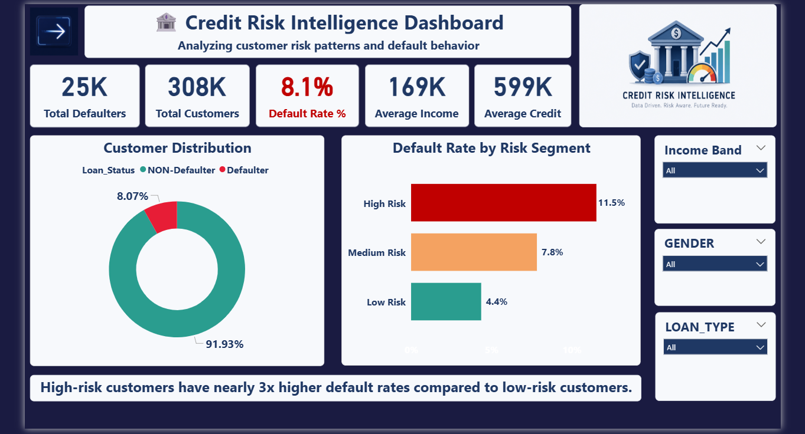
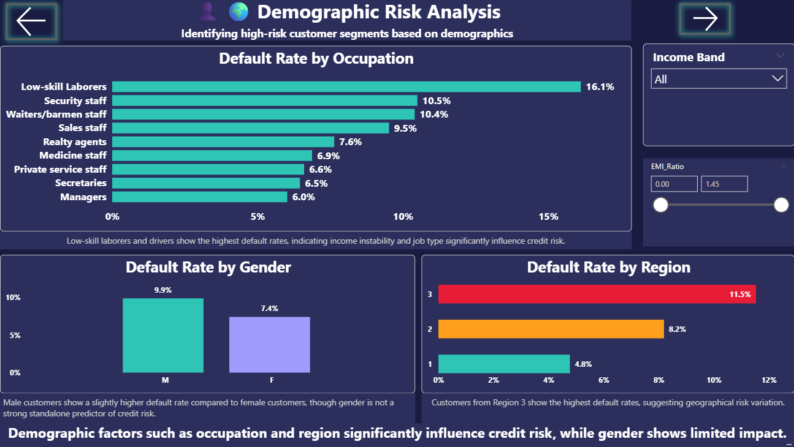
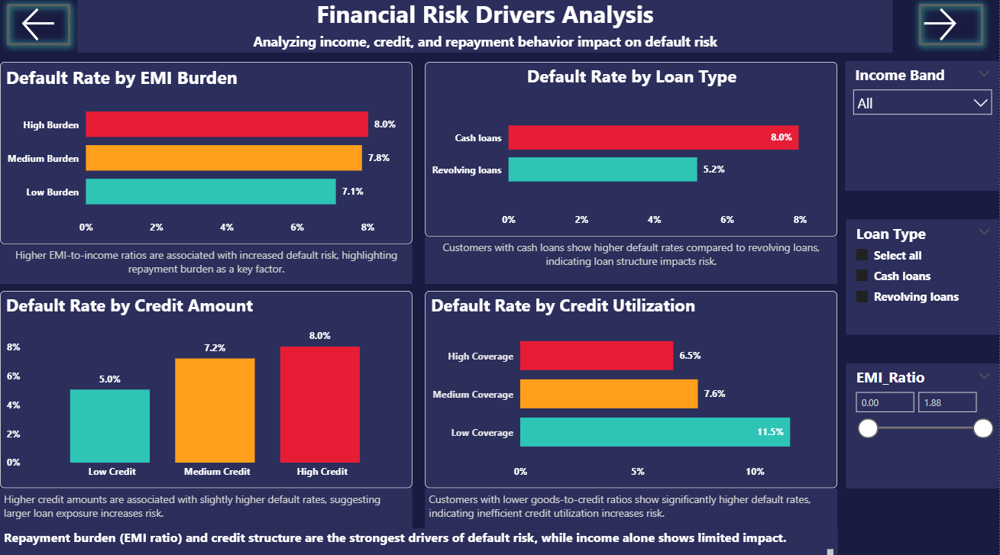
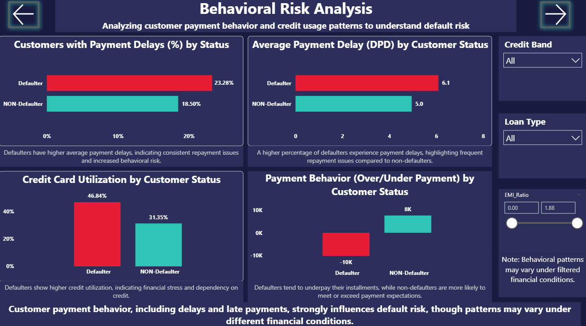
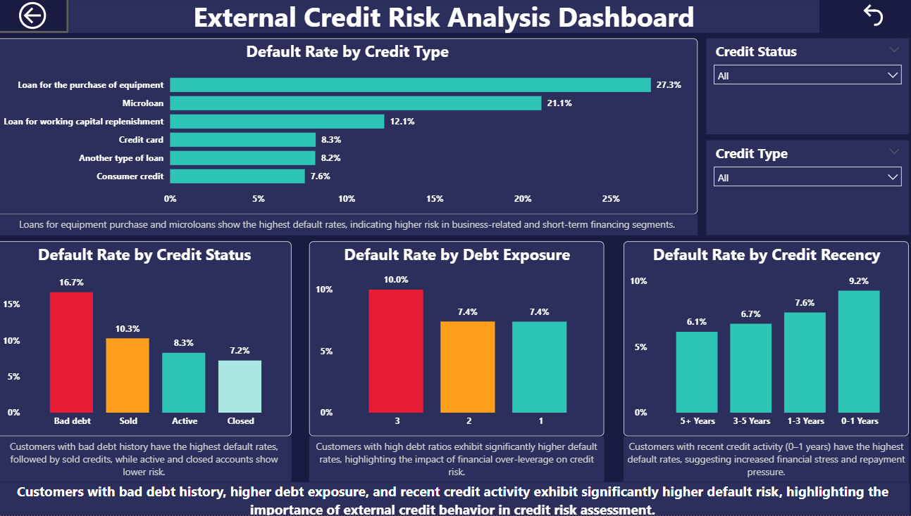
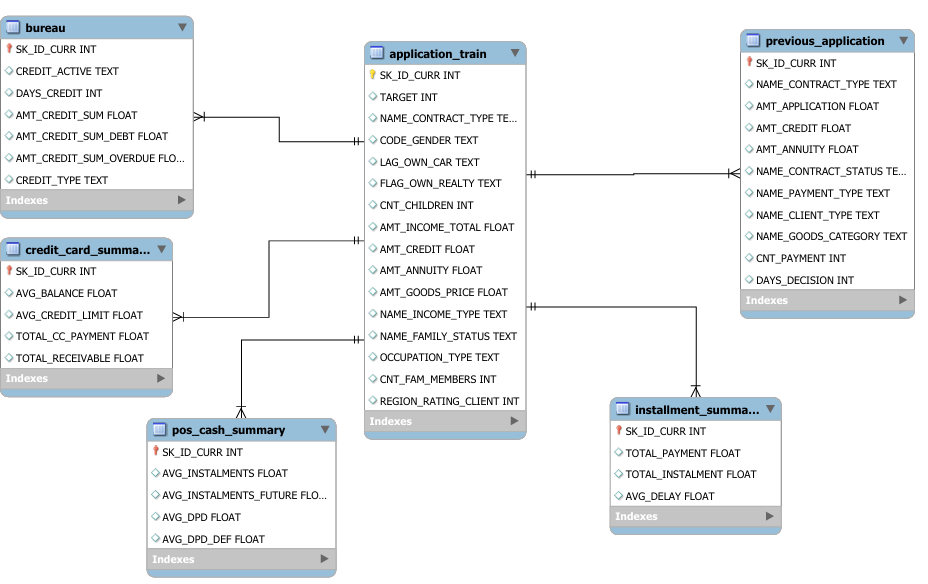

# 📊 Credit Risk Analysis Dashboard

🚀 End-to-end Credit Risk Analysis project solving real-world loan default problems using Python, SQL (Snowflake), and Power BI.

---

## 📌 Problem Statement

Financial institutions need to identify high-risk customers to reduce loan defaults and improve decision-making.

---

## 🛠 Tools

Python | SQL | Snowflake | Power BI | DAX

---

## 💡 Skills

* Data Cleaning & EDA
* SQL Analysis
* Data Modeling (Star Schema)
* Dashboard Development

---

## 📊 Dashboard Preview

### 🏦 Credit Risk Overview

### 👥 Demographic Risk Analysis

### 💰 Financial Risk Drivers

### 📉 Behavioral Risk Analysis

### 🌐 External Credit Risk Analysis

---

## 🗄 Data Model

---

## 🔗 Project Access

* 📓 EDA → [Open Notebook](Finance_Data_EDA.ipynb)
* 🧹 Cleaning → [Open Code](Finance_Data_Cleaning.ipynb)
* 🗄 SQL → [View Queries](Finance_sql_analysis.sql.sql)

---

## 📈 Key Insights

* High-risk customers have ~3x higher default rates
* EMI burden and credit utilization increase risk
* Payment behavior (delay, underpayment) is strong predictor

---

## 🚀 Business Value

Helps financial institutions identify risky customers and improve loan decisions.
